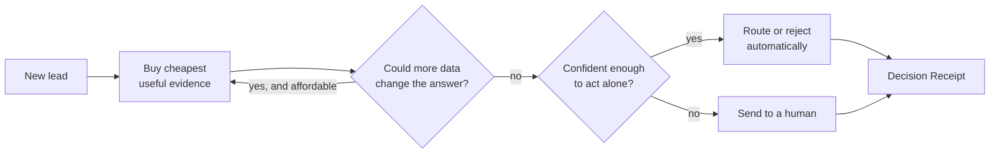
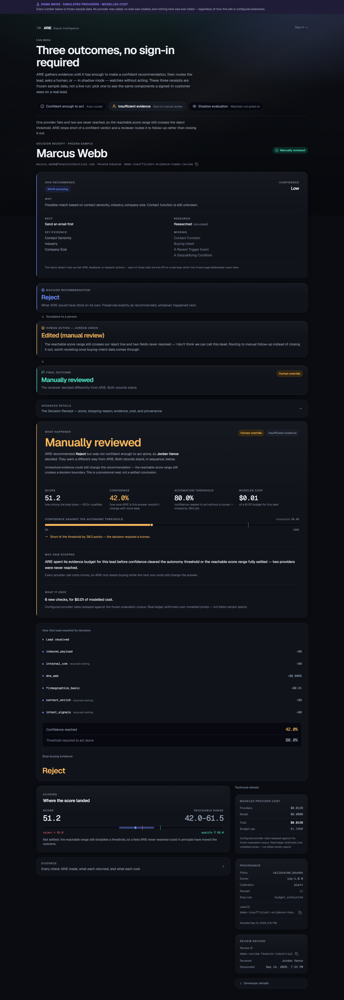
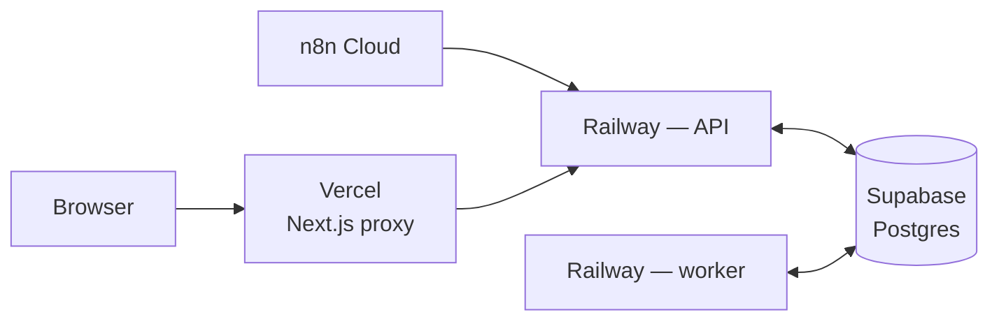

# ARIE — Adaptive Revenue Intelligence Engine

**ARIE decides what enrichment evidence is worth buying, when enough evidence
exists to act, when evidence is insufficient, and why it stopped.**

Most lead-enrichment pipelines call every data provider for every lead, then
ask a model to score whatever comes back. ARIE asks a different question
first: *given what I already know, is the next purchase even worth making?*

**[Try it — no login required](https://arie-web.vercel.app/demo)** · [Frontend repo](https://github.com/Tejesh080/arie-decision-console) · [Docs](#documentation)


---

## Why it exists

A sales team buys contact and company data per lookup. The usual pipeline runs
every provider on every lead, because deciding which ones to skip is harder
than just calling them all. Most of that spend buys nothing — the answer was
already obvious three providers ago.

ARIE treats it as a stopping problem instead. It buys the cheapest evidence
first, and after each purchase asks two questions: *could anything I haven't
bought yet still change this answer?* and *am I confident enough to act
without a person?* When both say no more is needed, it stops and decides. When
the evidence genuinely isn't enough, it says so — `evidence_sufficiency` is a
first-class, honestly-reported field, and insufficient evidence is never
allowed to present itself to a user as a definitive rejection.

The interesting part is what happens when it isn't confident. ARIE doesn't
guess. It hands the lead to a human, records what it would have done, and
keeps both records side by side afterwards — so you can always see where the
machine and the person disagreed.

I built this to find out whether that kind of adaptive stopping actually beats
a well-tuned fixed pipeline. **It does, on cost — and it costs you some
accuracy.** The honest numbers are [below](#results).

---

## How it works



Two separate rules, answering two different questions. *Settled* asks whether
anything left to buy could still flip the outcome. *Confidence* asks whether
the answer is actually right. A decision can be settled and still wrong, so
neither rule replaces the other.

More detail in [architecture.md](docs/architecture.md).

---

## The Decision Receipt

This is the part I'd point at first.

Every lead produces a receipt: what ARIE decided, how confident it was, why it
stopped buying data, what that cost, and which providers were involved. It is
reconstructed from stored facts, not re-derived later, so a receipt from three
months ago still explains a decision made under a policy version you've since
replaced.

One rule holds it together: **a machine recommendation and a human's decision
never collapse into a single "outcome" field.** If ARIE said reject and a
reviewer approved, the receipt shows both, in order, permanently. And
**insufficient evidence is never presented as a definitive rejection** — a
lead ARIE couldn't settle reads as "worth pursuing, needs a person," not
"no."

| Confident enough to act | Insufficient evidence |
|---|---|
|  |  |
| Confidence cleared the threshold, so ARIE acted alone. | The reachable range still crossed a threshold — ARIE stopped short and a person decided, instead of guessing. |

The provider ledger is deliberately blunt about waste. It separates evidence
bought fresh from evidence reused out of cache, and it names any provider that
charged for a call and returned nothing.

Try all three outcomes yourself, with no account: [/demo](https://arie-web.vercel.app/demo).

---

## Architecture



The API writes identity resolution, the lead row and its first job in one
transaction. A worker claims jobs with `SELECT ... FOR UPDATE SKIP LOCKED`, so
adding workers needs no coordination between them. No Redis, no Celery, no
Temporal — Postgres already gives transactional consistency with the lead
state those jobs mutate.

The same database carries a multi-tenant layer on top of that: Supabase-issued
sessions and scoped API keys for auth, row-level security per organization,
BYOK provider credentials in Supabase Vault, and a self-serve commercial layer
— signup, Stripe subscriptions, plan entitlements, transactional email.
Entitlements only ever decide what an organization may *configure*; they can
never grant autonomy the calibration data doesn't support, and every
entitlement change goes through one signature-verified Stripe webhook rather
than a browser redirect.

Full topology, environment variables and rollback path:
[deployment.md](docs/deployment.md). Design decisions and the ones
deliberately rejected: [architecture.md](docs/architecture.md) and
[docs/adr/](docs/adr/).

---

## Real-provider validation

Everything above is proven twice: a synthetic benchmark ([below](#results))
and a small, real-money validation against live vendors. Kept deliberately
separate, because they answer different questions.

Verified in a disposable, fully isolated environment, purpose-built so this
could never touch production: a fresh Supabase database branch
(`with_data:false`), a temporary organization with its own Vault-stored
Abstract + Hunter credentials, `execution_mode=live_shadow` (real evidence,
real cost, zero authoritative effect). Exactly three real leads, chosen to
cover a clean match, a genuinely ambiguous identity, and a known vendor edge
case — expectations pre-registered and frozen before any provider call.

| Lead | Category | Abstract | Hunter | Outcome |
|---|---|---|---|---|
| Steli Efti · Close | Strong fit | miss | `VERIFIED` match, scored | evidence scored normally |
| Hailley Griffis · Buffer | Ambiguous / role-alias email | success (firmographics) | miss — no identity found | correctly left unscored, not guessed |
| Patrick Collison · Stripe | Provider-quality edge case | success (firmographics) | `MISMATCH` — wrong person returned | evidence **correctly suppressed** |

**Total real spend: $0.01965.** Branch deleted after the run; a post-deletion
branch listing confirmed only the permanent production branch remained.
Production database and organization were never read from or written to at
any point.

The Patrick Collison case is the one worth dwelling on: Hunter returned a real
but wrong person's data — reproduced across three independent real calls on
three separate occasions. `arie.identity.validation` requires a `VERIFIED`
match verdict before any person-provider evidence can reach the scorer, so the
wrong person's title never entered the decision. That guard, and the vendor
defect it exists for, are both real — not a synthetic test case.

**This was an architecture/correctness validation at n=3, not a statistical
accuracy study.** No accuracy, ROI, or cost-savings claim is made from it.

---

## Results

Ten seeds, 300 held-out test leads each, dataset regenerated and the baseline
re-tuned per seed. This is the synthetic benchmark — the real-provider
validation above is a separate kind of evidence, at a much smaller scale.

| policy | agreement | API $/lead | calls | autonomy |
|---|---|---|---|---|
| full enrichment (call everything) | 0.8390 | 0.4447 | 8.00 | 0.816 |
| tuned waterfall (industry baseline) | 0.8347 | 0.4205 | 7.58 | 0.795 |
| **calibrated bounds** ← production | **0.8113** | **0.2463** | 5.26 | **0.833** |
| adaptive EVoI | 0.8093 | 0.2906 | 2.19 | 0.786 |

The project's founding hypothesis was expected-value-of-information (EVoI)
reasoning. It failed the bar set before running anything (≤1pp agreement loss
at ≥20% cost reduction) and lost to a much simpler ablation on 9 of 10 seeds —
the project's headline negative result, written up rather than buried:
[ADR 0004](docs/adr/0004-evoi-is-a-negative-result.md). **Calibrated bounds was
selected *after* the EVoI hypothesis failed that preregistered win condition**;
it reduces modeled API spend **~41.6%** versus the tuned waterfall baseline,
at **~2.3 percentage points lower** synthetic-oracle agreement — a stated
trade-off against the pre-registered bar, not a claim that it "won" anything.
The standard deviation on that saving is 11.0pp, large next to the effect.

Method, dataset design and every parameter assumption:
[benchmark.md](docs/benchmark.md).

---

## Engineering depth

- **Postgres `SKIP LOCKED` job queue**, no Redis/Celery/Temporal — a worker
  claims a job and commits the lead's new status in the *same* transaction as
  marking the job complete, which a separate queue technology would reopen as
  a dual-write hazard. Retry with backoff, dead-lettering after repeated
  failure, no coordination needed between workers.
  [ADR 0002](docs/adr/0002-postgres-queue-not-temporal-or-redis.md) records
  the trigger for revisiting this (north of ~1k jobs/sec) — nowhere near
  today's scale.
- **Org-scoped BYOK provider credentials** in Supabase Vault — a real
  credential is written/read exactly once per call site, and
  `organization_provider_configs` carries only a Vault secret pointer, never
  the value itself.
- **Two-layer live-execution safety**: a process-wide `PROVIDER_MODE` gate
  (does this deployment even have the live code path available) *and* a
  per-organization `execution_mode` (`simulated` / `live_shadow` /
  `live_human_only`) — an organization set to simulated gets genuinely
  simulated behavior even sharing a live worker with a live organization, not
  a degraded live path with zero evidence.
- **Identity verification before person evidence can score.** A person
  provider's returned name/employer is checked against what was actually
  requested; only a `VERIFIED` verdict allows those fields into the scorer.
  Directly responsible for correctly suppressing a real, reproduced Hunter
  wrong-person match (see [Real-provider validation](#real-provider-validation)
  above) instead of silently scoring the wrong person's title.
- **A deterministic boundary around LLM-assisted configuration.** The M7
  intelligence layer lets a customer describe their business in plain English
  and get a targeting/scoring profile out — but the model only interprets
  intent. A deterministic normalizer enforces the scoring invariants (the
  exactly-100.0-point ICP allocation ceiling among them); the model has no
  code path that lets it award itself points.
- **2,077 test functions**, CI-gated on every push: ruff lint + format, mypy
  strict, a migration-drift check (`supabase/migrations/` must stay a
  byte-identical generated mirror of `migrations/`), and a real-Postgres
  integration job — not just unit tests with everything mocked.
- **Decision Receipt provenance** — every receipt carries the exact policy
  name, scorer version, and calibration method that produced it, reconstructed
  from persisted state rather than re-derived, so a receipt from months ago
  still explains itself after the policy has moved on.

---

## MCP engineering interface

I built the safe diagnostic interface I'd want before letting an AI agent
anywhere near production — not a chat wrapper around `psql`.

A local, stdio-only [Model Context Protocol](https://modelcontextprotocol.io)
server gives Claude Code **11 read-only tools** for inspecting this system's
*runtime* state — queue health, provider errors, enrichment spend, routing
decisions, schema drift:

- Backed by a **dedicated Postgres role** that can `SELECT` from exactly the
  views in one schema and nothing else — verified live: querying a base table
  directly through that role raises `InsufficientPrivilege`, not merely "no
  tool exposes it."
- **5-second statement timeout enforced at the role level**, not just in
  client code, so a bug in this server's own SQL can't hang or write past that
  ceiling.
- **Every call — success or failure — appends to a local, redacted JSONL audit
  log.** Email addresses, connection strings, bearer tokens and API-key-shaped
  strings are stripped before truncation, not after.
- **No write path exists.** No admin endpoints, no arbitrary SQL, no control
  over infrastructure — out of scope for this version, not partially wired.

Used for real: a documented debugging session traced five dead-lettered jobs
to their root cause in three typed, capped, audited tool calls. Full writeup:
[mcp-architecture.md](docs/mcp-architecture.md).

---

## Simulated vs. real providers

Worth being precise about, because they're easy to conflate.

**The public [/demo](https://arie-web.vercel.app/demo) and the hosted console
run in simulated mode.** Known example identities replay a frozen evaluation
corpus; any other identity gets deterministic synthetic evidence generated
from the same provider catalogue and noise model, seeded by the lead's own
email and domain — so the same lead always resolves the same way. No vendor is
called and no money is spent either way, so the cost figures you see are
modelled cost at configured provider rates — not billed spend. Everything
around it is real: real Postgres queue, real worker, real persistence, real
receipts, real human-review workflow.

**Two real provider integrations have made real, billed calls**: Abstract
API's Company Enrichment and Hunter's Combined Enrichment — including the
validation above. **A third, Apollo's People Enrichment, is implemented and
fixture-tested but has not made a real call** — deliberately out of scope for
this portfolio milestone, not blocked on anything. All three sit behind the
same `EnrichmentProvider` interface the simulator implements.

Live mode's default **optimized** strategy walks providers cheapest-first
(Abstract $0.00165 → Hunter ~$0.0049 → Apollo ~$0.0196, all modelled figures)
and stops the moment existing evidence answers the question. A private
**evaluation** strategy deliberately calls the person providers in parallel on
controlled identities so their coverage, quality, latency, and agreement can
be measured (`scripts/provider_bakeoff.py`) before any waterfall order is
declared the winner.

Details of both: [provider-integration.md](docs/provider-integration.md).

---

## Tech stack

Python 3.12 · FastAPI · Postgres (Supabase) · pytest · Docker
Next.js 16 · React 19 · TypeScript (strict) · Tailwind CSS v4 · Motion
Vitest + Testing Library · Playwright (e2e)
Railway (API + worker) · Vercel (frontend) · n8n Cloud (edge workflows)
Supabase Auth + Vault · Stripe · OpenTelemetry · Model Context Protocol

---

## Run locally

Reproduce the benchmark — no API keys, no network:

```bash
pip install -e ".[dev,service]"
make dataset      # generate the seeded evaluation set
make bench        # single-seed benchmark
python -m bench.multi_seed   # 10 seeds
```

Or run the whole stack and watch it decide, escalate, and honour an override.
Needs Docker:

```powershell
.\scripts\demo.ps1
```

The demo brings up Postgres, the API and the worker, submits a few leads from
the frozen corpus, and prints their receipts.

---

## Documentation

| | |
|---|---|
| [architecture.md](docs/architecture.md) | How it works, the invariants, what's where in the code |
| [benchmark.md](docs/benchmark.md) | Dataset design, measured results, every assumption |
| [deployment.md](docs/deployment.md) | Hosted topology, config, migrations, rollback |
| [provider-integration.md](docs/provider-integration.md) | The real adapters, live verification status, and shadow mode |
| [mcp-architecture.md](docs/mcp-architecture.md) | The read-only MCP engineering interface Claude Code connects to |
| [portfolio.md](docs/portfolio.md) | Short explanations, resume bullets, and what not to claim |
| [docs/adr/](docs/adr/) | Decision records, including the negative result |

---

## Limitations

- **Live autonomy remains hard-disabled in code**, not by policy switch. A
  lead enriched by a real provider always terminates at a human (or at
  `SHADOW_EVALUATED` if run as shadow) — `tau` is fitted on the synthetic
  calibration split, and applying it to real-provider evidence with different
  coverage and error modes would be an unmeasured claim wearing a calibrated
  number's clothes. See [Live V1 Foundation](docs/provider-integration.md#live-v1-foundation).
- **The n=3 real-provider validation is an architecture/correctness proof, not
  a statistical accuracy study.** No accuracy, ROI, or cost-savings figure is
  claimed from it, and none should be inferred.
- **The synthetic benchmark and the real-provider validation are separate
  kinds of evidence.** The benchmark proves the policy against a *modelled*
  provider/noise distribution at real statistical scale (10 seeds, 3,000
  leads); the real validation proves the live architecture is wired correctly
  at real (tiny) scale. Neither substitutes for the other.
- **Apollo has not been live-validated** — contract-tested against fixtures
  and the vendor's published documentation only.
- **No large-scale customer deployment or load validation.** The only
  concurrency proof is small: five simultaneous submissions against the same
  identity, all settled correctly with no duplicate processing — not load
  testing. No auth/tenancy beyond a single-tenant proof.
- **The public `/demo` is simulated by design** — frozen corpus and
  deterministic synthetic evidence, clearly labelled, no vendor called, no
  money spent, regardless of what you type into it.
- The cheapest-first provider order is a reasoned prior awaiting the
  bake-off's measurements, not a result. And the EVoI result stays open:
  [ADR 0004](docs/adr/0004-evoi-is-a-negative-result.md) names three concrete
  conditions under which it might actually win — none tested here.

---

## License

MIT — see [LICENSE](LICENSE).
