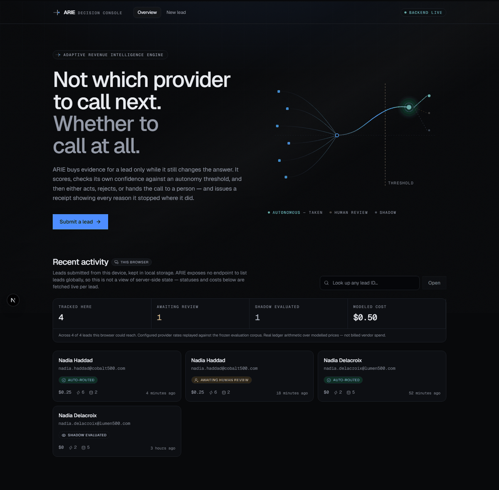
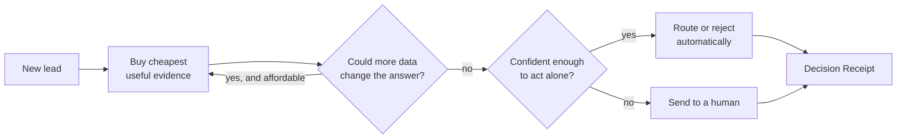
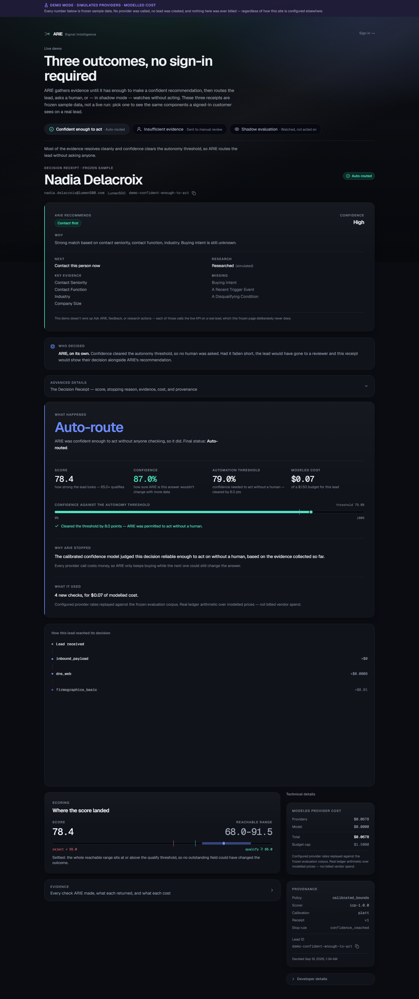
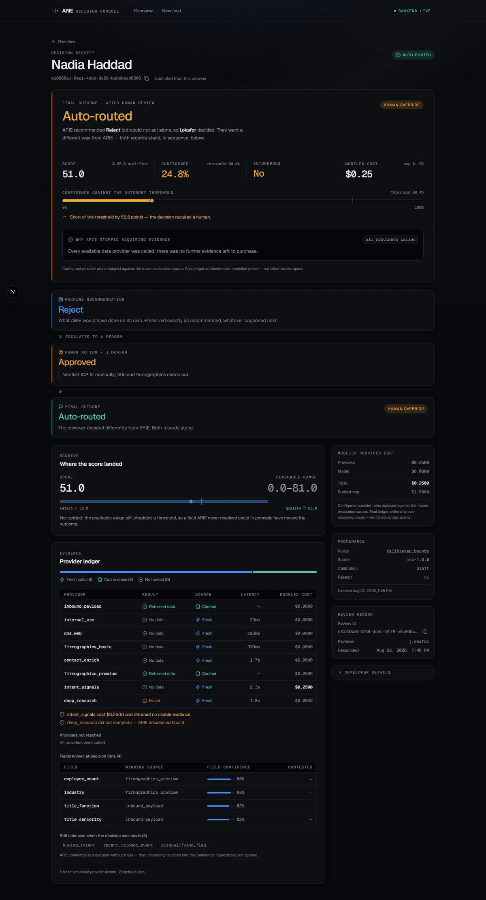
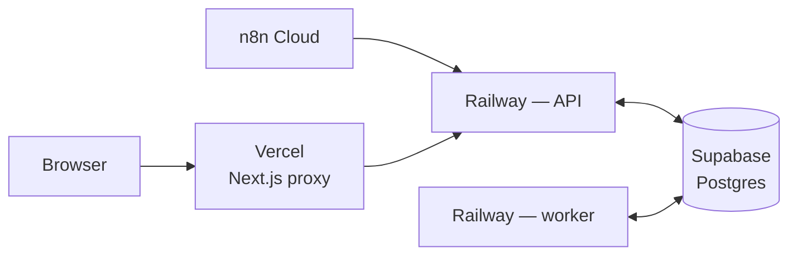

# ARIE — Adaptive Revenue Intelligence Engine

**Lead enrichment that decides when to stop buying data.**

Most enrichment pipelines call every data provider for every lead, then ask a
model to score the result. ARIE asks a different question first: *given what I
already know, is the next API call worth paying for?*

**[Live demo](https://arie-web.vercel.app/)** · [Frontend repo](https://github.com/Tejesh080/arie-web) · [Docs](#documentation)



---

## Why it exists

A sales team buys contact and company data per lookup. The usual pipeline runs
every provider on every lead, because deciding which ones to skip is harder than
just calling them all. Most of that spend buys nothing — the answer was already
obvious three providers ago.

ARIE treats it as a stopping problem instead. It buys the cheapest evidence
first, and after each purchase asks two questions: *could anything I haven't
bought yet still change this answer?* and *am I confident enough to act without
a person?* When both say no more is needed, it stops and decides.

The interesting part is what happens when it isn't confident. ARIE doesn't guess.
It hands the lead to a human, records what it would have done, and keeps both
records side by side afterwards — so you can always see where the machine and
the person disagreed.

I built this to find out whether that kind of adaptive stopping actually beats a
well-tuned fixed pipeline. **It does, on cost — and it costs you some accuracy.**
The honest numbers are [below](#results).

---

## How it works



Two separate rules, answering two different questions. *Settled* asks whether
anything left to buy could still flip the outcome. *Confidence* asks whether the
answer is actually right. A decision can be settled and still wrong, so neither
rule replaces the other.

More detail in [architecture.md](docs/architecture.md).

---

## What you can try

On the [live demo](https://arie-web.vercel.app/), submit a lead and watch it
resolve one of three ways:

| | What happens |
|---|---|
| **Autonomous decision** | Confidence clears the threshold, so ARIE routes or rejects the lead on its own. |
| **Human review** | Confidence falls short. ARIE stops, explains why, and waits for a person to approve, reject, or override. |
| **Shadow evaluation** | ARIE computes the full recommendation and takes no action at all — useful for running it alongside an existing workflow to see what it *would* have done. |

The form offers two prepared identities that reliably produce the first two
outcomes, plus a shadow-mode toggle.

---

## The Decision Receipt

This is the part I'd point at first.

Every lead produces a receipt: what ARIE decided, how confident it was, why it
stopped buying data, what that cost, and which providers were involved. It is
reconstructed from stored facts, not re-derived later, so a receipt from three
months ago still explains a decision made under a policy version you've since
replaced.

One rule holds it together: **a machine recommendation and a human's decision
never collapse into a single "outcome" field.** If ARIE said reject and a
reviewer approved, the receipt shows both, in order, permanently.

| Autonomous decision | Human override |
|---|---|
|  |  |
| Confidence cleared the threshold, so ARIE acted alone. | ARIE recommended reject; a reviewer approved. Both records stand. |

The provider ledger is deliberately blunt about waste. It separates evidence
bought fresh from evidence reused out of cache, and it names any provider that
charged for a call and returned nothing.

---

## Architecture



The API writes identity resolution, the lead row and its first job in one
transaction. A worker claims jobs with `SELECT ... FOR UPDATE SKIP LOCKED`, so
adding workers needs no coordination between them. No Redis, no Celery, no
Temporal — Postgres already gives transactional consistency with the lead state
those jobs mutate.

Full topology, environment variables and rollback path:
[deployment.md](docs/deployment.md). Design decisions and the ones deliberately
rejected: [architecture.md](docs/architecture.md) and [docs/adr/](docs/adr/).

---

## Results

Ten seeds, 300 held-out test leads each, dataset regenerated and the baseline
re-tuned per seed.

| policy | agreement | API $/lead | calls | autonomy |
|---|---|---|---|---|
| full enrichment (call everything) | 0.8390 | 0.4447 | 8.00 | 0.816 |
| tuned waterfall (industry baseline) | 0.8347 | 0.4205 | 7.58 | 0.795 |
| **calibrated bounds** ← production | **0.8113** | **0.2463** | 5.26 | **0.833** |
| adaptive EVoI | 0.8093 | 0.2906 | 2.19 | 0.786 |

**41.6% cheaper than a tuned waterfall, at 2.3 percentage points lower decision
agreement.**

Two things I'd rather say up front than have you find later. First, the bar I set
before running anything was ≤1pp agreement loss at ≥20% cost reduction, and
nothing met it — this is a trade-off, not a win. Second, the standard deviation
on that saving is 11.0pp, which is large next to the effect.

The project's founding idea was expected-value-of-information. It lost, to a much
simpler policy, on 9 of 10 seeds. That negative result is written up rather than
buried: [ADR 0004](docs/adr/0004-evoi-is-a-negative-result.md).

Method, dataset design and every parameter assumption: [benchmark.md](docs/benchmark.md).

---

## Simulated vs. real providers

Worth being precise about, because they're easy to conflate.

**The hosted demo runs in simulated mode.** It replays a frozen evaluation
corpus. No vendor is called and no money is spent, so the cost figures you see
are modelled cost at configured provider rates — not billed spend. Everything
around it is real: real Postgres queue, real worker, real persistence, real
receipts, real human-review workflow, real n8n orchestration.

**One real provider integration exists and was verified with real billed calls.**
ARIE's provider abstraction is wired to Abstract API's Company Enrichment
endpoint through the same interface the simulator implements. Verifying it turned
up a genuine bug on the first live call, which is documented rather than quietly
fixed.

Details of both: [provider-integration.md](docs/provider-integration.md).

---

## Tech stack

Python 3.12 · FastAPI · Postgres (Supabase) · pytest · Docker
Next.js 16 · React 19 · TypeScript · Tailwind CSS v4 · Motion
Railway (API + worker) · Vercel (frontend) · n8n Cloud (edge workflows)

---

## Run locally

Reproduce the benchmark — no API keys, no network:

```bash
pip install -e ".[dev,service]"
make dataset      # generate the seeded evaluation set
make bench        # single-seed benchmark
python -m bench.multi_seed   # 10 seeds
```

Or run the whole stack and watch it decide, escalate, and honour an override.
Needs Docker:

```powershell
.\scripts\demo.ps1
```

The demo brings up Postgres, the API and the worker, submits a few leads from the
frozen corpus, and prints their receipts.

---

## Documentation

| | |
|---|---|
| [architecture.md](docs/architecture.md) | How it works, the invariants, what's where in the code |
| [benchmark.md](docs/benchmark.md) | Dataset design, measured results, every assumption |
| [deployment.md](docs/deployment.md) | Hosted topology, config, migrations, rollback |
| [provider-integration.md](docs/provider-integration.md) | The real adapter, and shadow mode |
| [portfolio.md](docs/portfolio.md) | Short explanations, and what not to claim |
| [docs/adr/](docs/adr/) | Decision records, including the negative result |

---

## Limitations

- The benchmark is synthetic. It proves the policy against a modelled provider
  distribution, not against real-world data drift or vendor-specific failures.
- Only one real provider is wired, populating two fields.
- No auth, no tenancy. This is a single-tenant proof, not a product.
- The hosted concurrency check is small — five simultaneous submissions
  completed without duplicate processing. That is not load testing.
- `arie.llm` (DeepSeek buying-signal extraction) is built and tested but not
  called by the worker; ingestion carries no free-text field for it yet.

---

## License

MIT — see [LICENSE](LICENSE).
