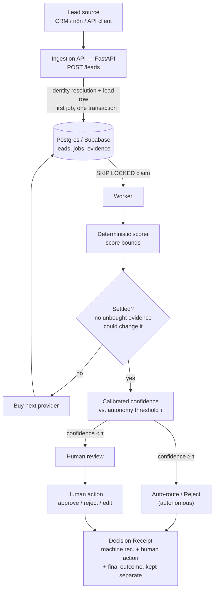

# Architecture

How a lead moves through ARIE, what decides when to stop buying data, and the
invariants that hold the whole thing together.

---

## The flow



Every step above is real code. The API writes identity resolution, the lead row
and the first job in one transaction; the worker claims jobs with
`SELECT ... FOR UPDATE SKIP LOCKED`, so running more workers needs no
coordination between them.

---

## What the policy actually does

```
1. Walk providers cheapest-first.
2. Stop when the decision is provably SETTLED — no unbought evidence
   could change it, whatever it turned out to say.
3. Stop when calibrated CONFIDENCE clears tau — safe to act without a human.
4. Otherwise buy the next provider.
```

Both rules are load-bearing and answer different questions. *Settled* asks "can
anything still change this?" *Confidence* asks "is this right?" Bounds are
computed from observed facts, which are noisy, so a settled decision can still be
wrong — neither rule subsumes the other.

**Score bounds.** Given what is known, the reachable score has a floor and a
ceiling set by what unknown fields could contribute. When that whole interval
falls on one side of a decision boundary, no purchasable evidence can change the
outcome. One asymmetry drives real behaviour: while the disqualifying flag is
unknown the floor is *zero*, because a blocker can nullify any lead however
strong — so auto-routing can never be *proven* safe until it is checked.

**Calibrated confidence.** Not an LLM saying `0.82`. A logistic model over
uncertainty features, Platt/isotonic-calibrated on out-of-fold predictions
grouped by company, with published ECE and reliability bins. The autonomy
threshold τ comes from a **Clopper-Pearson upper bound** on selective error, not
the observed rate — zero errors in ten accepted predictions is weak evidence, and
the bound says so.

Measured: **ECE 0.061**, τ ≈ 0.79, autonomy ≈ 0.83 — higher autonomy than buying
everything, because extra evidence can introduce conflict between sources and
pull confidence back down.

---

---

## Invariants worth knowing before you change anything

These are the traps, each one found by measurement and each pinned by a
regression test.

**1. `is_settled` does not mean "certainly correct".**
Bounds are computed from *observed* facts, which are noisy. A settled decision
can still disagree with the oracle when a provider lied. Settled means "nothing
left worth buying"; confidence means "this is probably right". Wiring the
autonomy gate to `is_settled` would hand out unearned autonomy. Use
`confidence >= model.tau`.

**2. The confidence model must be refit, not pickled.**
It trains in seconds. A checked-in artefact drifts out of sync with the code that
produced it, silently. `fit_confidence_model` raises if handed a test-split lead
— keep that guard when you wire real data.

**3. τ is unstable and will move.**
Across seeds it ranges 0.69–0.93. It is a function of the calibration data, so it
will change every time you refit on new leads. Do not hardcode it, do not surface
it as a config constant, and do log it per fit. If τ ever comes back as `1.01`
(`REJECT_ALL_THRESHOLD`), the model could not certify any operating point and the
correct behaviour is to escalate everything — not to lower the bar.

**4. The 10% error budget is a policy choice, not a law.**
5% is not achievable on this model — see
`test_five_percent_budget_is_not_achievable`. If a stakeholder asks for 5%, the
honest answer is "then we automate nothing", not "we'll tune it".

**5. Cache hits must be recorded, not skipped.**
`CallLedger.record(..., cache_hit=True)` logs a zero-cost call. Dropping them
makes cache hit rate unmeasurable, and that metric is the justification for the
company-level evidence store. `PostgresCostLedger.record_provider_call` mirrors
this exactly — a hit is a row at zero cost, not a missing row.

**6. The cost ledger must NOT join the caller's transaction.**
Everything else in M1 argues the opposite way, so this reads like a mistake and
isn't. A rollback does not un-spend money: if a provider call succeeded and the
handler then crashed, rolling the ledger row back means the retry pays again
and no record of the first charge exists anywhere. Ledger writes commit
independently and are made safe by `idempotency_key`, not by sharing a
transaction.

**7. A trace must never be able to fail a job.**
`extract_trace_context` returns `None` for a missing, empty, *or unparseable*
carrier, and the worker starts its own trace instead. A malformed
`traceparent` — a hand-edited row, a future spec version — is an observability
problem; dropping work over it would be a much worse one.

**8. A review's own idempotency and the lead's optimistic concurrency are two
different guards, not one.** `submit_decision` completing a review (the CAS on
`human_reviews.responded_at`) and `apply_transition` moving the lead (the CAS
on `leads.version`) fail independently, and both surface as 409 — but only a
version conflict is safe to retry immediately after re-reading the lead's
current version; a content conflict (`ReviewConflictError`) means someone
already decided this review differently, and retrying with the same body
fixes nothing. Collapsing the two into one error type would make a client's
correct response depend on parsing a message string instead of the exception
class it caught.

---

---

## Things this project found the hard way

Each is a bug or false result caught by measurement, and each is pinned by a
regression test.

| Finding | Why it mattered |
|---|---|
| A 5% autonomous-error guarantee was **small-sample luck** | With 4x the evaluation data the top confidence block shows ~8% error against a stated ~4%. The deployable budget is 10%; at 5% the system correctly automates nothing. |
| The first EVoI estimator **paralysed the policy** | From a cold start no single provider can move the score past a threshold, so every candidate scored zero and nothing was ever bought. Textbook myopia. |
| Raising business value made the policy buy **less** | Budget affordability was checked *after* the argmax, and the priciest provider tends to win it. The inversion in the results table was the bug's signature. |
| Company-scoped providers returned **per-person** answers | Made company-level caching lossy and let full enrichment disagree with itself. |
| Two contacts drew the **same email** | Email is the canonical person key, so two distinct people were silently merged. |
| Difficulty was **confounded** with cache-hit opportunity | Contact count was drawn from the company RNG, so it depended on which code branch ran. |
| `expires_at` could not be a **`GENERATED`** column | `timestamptz + interval` is STABLE, not IMMUTABLE. Found by running the migration against a real database for the first time. |
| Cost per *qualified* lead **counted rejections as qualified** | `SYNCED` is where the reject branch terminates, so rejecting more leads made the metric look better — inverting the failure mode the view exists to expose. |
| Escalation rate counted a lead **once per review** | A `LEFT JOIN` to `human_reviews` fanned each lead out per review, so a twice-reviewed lead was two leads. |
| The lead budget cap defaulted **below the priciest provider** | `$0.50` against `deep_research` at `$0.600` — the only source of the disqualifying flag. The config had fixed this; the column default never got the memo. |

---

---

## Choices deliberately not made

**Deliberately rejected**, with reasons in [`docs/adr/`](adr/): LangGraph
(the loop is a calculation, not agentic reasoning), Temporal (single-service
scale), Redis (Postgres gives transactional consistency with lead state),
RAG/pgvector (no genuine use case survived scrutiny), "multiple agents" (naming,
not architecture).

---

---

## Where the code lives

```
src/arie/
  api/          FastAPI ingestion + review endpoints, Decision Receipt assembly
  core/         shared types: LeadStatus, Decision, the domain vocabulary
  scoring/      deterministic scorer and score bounds (no I/O, no model)
  confidence/   calibrated confidence model, feature extraction, tau selection
  policy/       the stopping controller that composes scoring + confidence
  providers/    EnrichmentProvider Protocol; simulated registry, synthetic-identity fallback, two live adapters (Abstract company, Apollo person) + Apollo's fixture-only normalization contract
  normalization/ canonical taxonomy + the provider->scorer adapter boundary
  icp.py        the named reference ICP for Live V1 (descriptive, not a scorer)
  live/         live-mode autonomy guard and spend caps
  jobs/         Postgres job queue (SKIP LOCKED), worker loop, handlers
  statemachine/ transitions, status groups, optimistic concurrency
  approval/     human review workflow
  evalgen/      frozen synthetic corpus generator (benchmark only)
  llm/          DeepSeek buying-signal extraction (built, standalone)

bench/          benchmark harness, cost model, multi-seed runner
migrations/     canonical SQL migrations (source of truth)
supabase/       generated mirror of migrations/ for Supabase Branching
workflows/n8n/  the two edge workflows plus a mock sink
scripts/        demo CLI, policy lab, migration runner, live provider smoke test,
                integration-test database designation (test_db.py)
```
