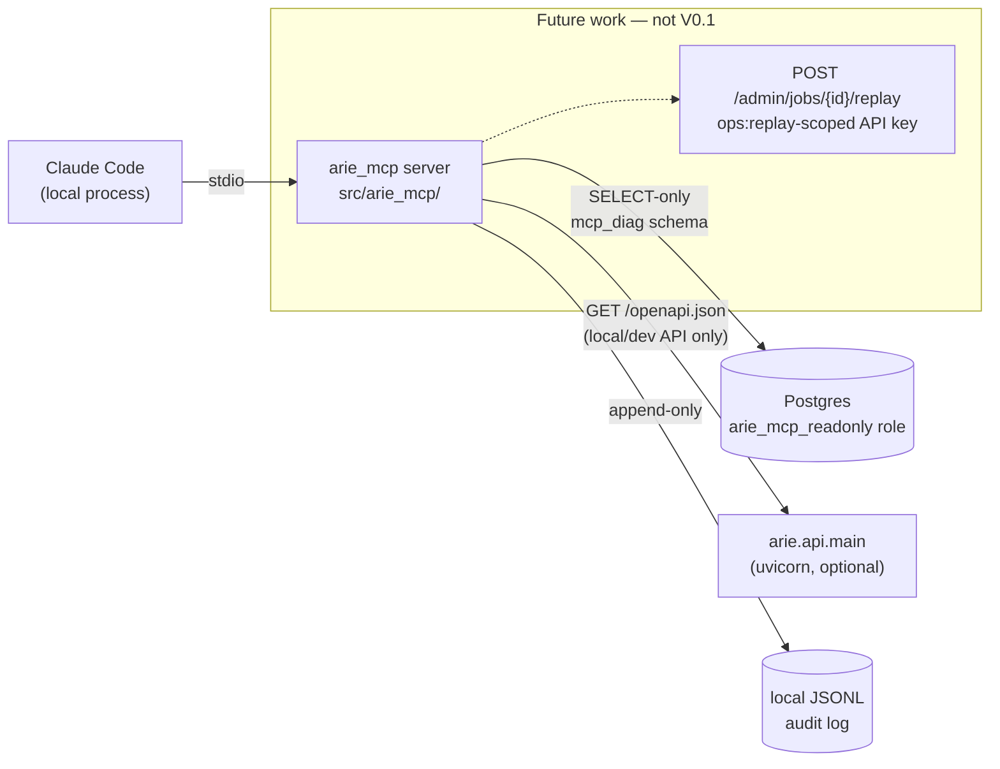
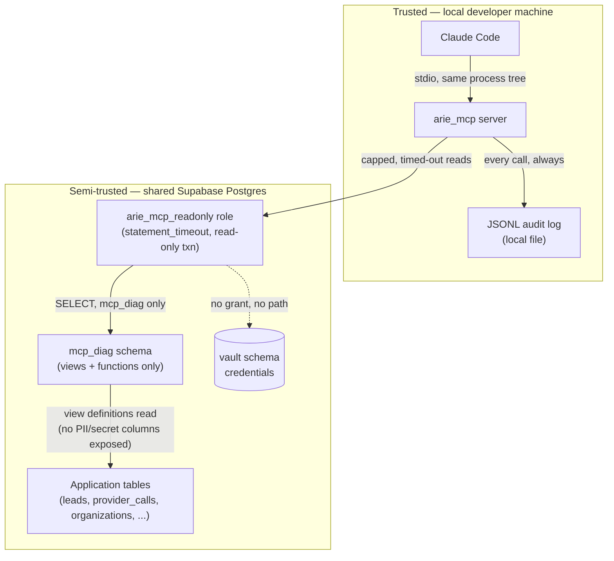

# ARIE MCP Engineering Interface — Specification

Status: **Draft — not yet implemented.** This document defines what will be
built before any code is written. Implementation must trace back to this
spec; a change to behavior described here requires updating this file first.

Authoritative decisions referenced throughout (§ numbers below) were fixed
before this draft was written and are not open for silent reinterpretation
during implementation — see "Unresolved decisions" at the end for what
*is* still open.

---

## 1. Problem

Claude Code working on this repository today has two ways to learn what the
running system is actually doing: read source (which describes intent, not
runtime state) or ask a human to run a command and paste the output back.
Neither scales to the debugging, feature-development, and incident-response
loops this project's own `docs/architecture.md` describes. There is no
structured, typed, safe way for an AI coding agent to ask "is the schema
current," "why did this job fail," "is Hunter cooling down," or "what did
this lead actually cost" without either shelling out arbitrarily or being
handed credentials wide enough to do real damage.

This spec defines a Model Context Protocol (MCP) server that closes that gap
for **runtime information filesystem tools cannot provide** — deliberately
not a general-purpose remote-control surface, and deliberately not a
duplicate of `Read`/`Grep`/`Glob` over the checked-out repo.

## 2. Users

- **Claude Code**, running locally against this checked-out repository,
  connecting to the MCP server over stdio as a client of the developer's own
  Claude Code session. This is the only client V0.1 designs for.
- **The maintainer**, indirectly: every tool call is auditable, so a human
  can review exactly what an agent looked at after the fact.
- Not a user in V0.1: any other person's Claude Code session, any hosted
  service, any non-stdio MCP client. See Non-goals.

## 3. Non-goals (V0.1 and beyond, unless explicitly revised)

- No arbitrary shell execution.
- No arbitrary SQL, and no "safe SQL" free-text input of any kind.
- No production migrations triggered through MCP (`scripts/migrate.py
  --apply` is never invoked by this server).
- No Supabase Vault access, no credential values of any kind, ever, in any
  tool's output.
- No provider secrets (API keys, BYOK credentials) in any form.
- No frontend (`arie-decision-console`) source manipulation — that repo is
  out of scope, consistent with the existing frontend-repo boundary this
  project already observes.
- No generic `retry_safe_operation`/`execute_command` dispatcher. Every
  state-changing capability, when it arrives, is a named, single-purpose
  tool with its own schema.
- No new infrastructure dependency (Redis, Celery, Temporal, Kafka,
  Kubernetes, LangGraph) introduced on this project's behalf.
- No product feature work hidden inside this effort. If a tool's
  implementation would require changing `arie.*` business logic beyond
  exposing an existing read path, that is out of scope for this spec and
  needs its own proposal.
- No public network listener. See § Transport.
- No remote/Streamable-HTTP MCP transport in V0.1. This is explicitly future
  work, not deferred-and-assumed.

## 4. Architecture



The MCP server is a new Python package, `src/arie_mcp/`, living inside this
repository and built with the official MCP Python SDK, Pydantic (for every
tool's input/output schema — the same rigor the API layer already applies
via `arie.api.schemas`), and the project's existing `pytest`/`ruff`/`mypy
--strict` toolchain. It is packaged as an optional-dependency extra
(`arie[mcp]`) rather than a separate project, so it can `import arie.*`
directly and inherit the guarantees those modules already provide (see
`docs/mcp-architecture.md`, to be written after this spec is approved, for
the reuse table).

It does not run as a long-lived network service. It is a process Claude Code
launches, talks to over stdio, and terminates — the same shape as any other
local MCP server. It has two outbound dependencies, both optional at
startup (a tool that needs an unavailable dependency reports that clearly
instead of the server failing to start):

1. **Postgres**, as `arie_mcp_readonly` — for every DB-backed diagnostic
   tool.
2. **The local/dev FastAPI process** (`arie.api.main:app`, typically
   `http://localhost:8000`) — for `inspect_api_contract` only, since that
   tool's entire purpose is to read the *running* app's generated OpenAPI
   schema, not a static file.

Every other V0.1 tool is DB-grounded rather than HTTP-grounded, deliberately:
a developer debugging "the API won't start" needs schema/queue/worker state
to still be inspectable when the API process is down.

## 5. Transport

**Stdio only, V0.1.** The server is launched as a local subprocess (e.g. via
a `.mcp.json` / Claude Code MCP server configuration pointing at `python -m
arie_mcp.server`), communicates over stdin/stdout per the MCP stdio
transport, and exposes nothing on any network interface. There is no HTTP
listener, no port, no CORS surface, no auth-token-over-the-wire concern to
design for in V0.1 — the trust boundary is "whoever can run a process on
this machine," which is already the trust boundary Claude Code itself
operates inside.

Remote/Streamable HTTP transport is explicitly out of scope for this spec.
If it is built later, it requires its own threat model (auth between
non-local caller and server, network exposure, multi-tenant caller identity)
and its own spec revision — none of that is designed here.

## 6. Trust boundaries



Two boundaries matter:

- **Claude Code ↔ MCP server**: same machine, same trust level as any other
  local tool Claude Code already runs (Bash, Read, Edit). No additional
  authentication layer is introduced for this boundary in V0.1 — if the
  process can be launched, it can be used, exactly like every other local
  tool.
- **MCP server ↔ Postgres**: crosses into a shared, multi-tenant production
  or dev database. This is the boundary that actually matters and is where
  every constraint in § 7 applies. `arie_mcp_readonly` is a distinct
  credential from the API's service-role connection string, distinct from
  `TEST_DATABASE_URL`, and is never granted anything outside `mcp_diag`.

## 7. Database permission model

### 7.1 Role

A new Postgres role, `arie_mcp_readonly`, created by a future migration
(`migrations/0039_mcp_diag_schema.sql` — not written yet; see § Files to
create next). Properties:

- `LOGIN`, password supplied via a new env var `MCP_READONLY_DATABASE_URL`
  (separate from `DATABASE_URL`, `DATABASE_DIRECT_URL`, and
  `TEST_DATABASE_URL` — never reuses or falls back to any of them, the same
  "no default target" discipline `scripts/migrate.py` and
  `scripts/test_db.py` already enforce for their own connection selection).
- `ALTER ROLE arie_mcp_readonly SET default_transaction_read_only = on;` —
  belt-and-suspenders: even a future grants mistake cannot produce a write,
  because the session itself refuses one.
- `ALTER ROLE arie_mcp_readonly SET statement_timeout = '5s';` — a role-level
  default applies at connection start regardless of whether the connection
  arrives through a pooler, unlike a per-session `SET`.
- `GRANT USAGE ON SCHEMA mcp_diag TO arie_mcp_readonly;`
  `GRANT SELECT ON ALL TABLES IN SCHEMA mcp_diag TO arie_mcp_readonly;`
  `ALTER DEFAULT PRIVILEGES IN SCHEMA mcp_diag GRANT SELECT ON TABLES TO
  arie_mcp_readonly;` (so a future view added to the schema doesn't need a
  follow-up grant migration).
- **No grant anywhere else.** No `SELECT` on `public.*` base tables, no
  `USAGE` on any other schema. `vault.*` already restricts reads to
  `postgres`/`service_role` (`src/arie/vault.py`'s own documented privilege
  boundary) — `arie_mcp_readonly` is simply never granted anything there,
  and the migration adds an explicit `REVOKE ALL ON SCHEMA vault FROM
  arie_mcp_readonly` as documentation of intent, not because it would
  otherwise be reachable.

### 7.2 `mcp_diag` schema

A dedicated schema, `mcp_diag`, holding **views and functions only** — never
a table the role could be mistakenly granted write access to, and never a
materialized view (which would need its own refresh/write path). Every
diagnostic tool reads through exactly one `mcp_diag` object; no tool queries
a `public` table directly, even for a column that looks harmless today,
because that discipline is what keeps "what can `arie_mcp_readonly` see"
answerable by listing one schema's contents rather than auditing call sites.

Planned views (final column lists confirmed at implementation time against
the migrations cited; nothing here invents a column that wasn't verified
during the audit):

| View | Backing | Purpose |
|---|---|---|
| `mcp_diag.v_schema_migrations` | `schema_migrations` | applied migration filenames + timestamps |
| `mcp_diag.v_job_detail` | `jobs` LEFT JOIN `leads` (status, is_shadow, organization_id only) | single-job lookup |
| `mcp_diag.v_failed_jobs` | `jobs` WHERE status IN ('failed','dead_letter') | queue failure listing |
| `mcp_diag.v_queue_depth` | `jobs` GROUP BY status | pending/processing/failed/dead_letter counts |
| `mcp_diag.v_provider_call_errors` | `provider_calls` WHERE `error_kind IS NOT NULL OR suppressed_reason IS NOT NULL` — **excludes `raw_response_ref`** | recent-errors source |
| `mcp_diag.v_provider_quota_signal` | `provider_calls` WHERE `error_kind IN ('quota_exhausted','insufficient_credits')`, `MAX(requested_at)` per (provider, organization_id) | cooldown-state input (window applied in Python, reusing `arie.live.cooldown`'s constants — see § 7.3) |
| `mcp_diag.v_cost_rollup` | `provider_calls` + `model_calls`, aggregated by provider/day/organization_id | `get_enrichment_costs` |
| `mcp_diag.v_lead_cost_summary` | `v_lead_cost` (already PII-free: lead_id, status, cost figures, is_shadow) | per-lead cost lookup |
| `mcp_diag.v_voi_decisions` | `voi_decisions` | `inspect_routing_decision` |
| `mcp_diag.v_worker_heartbeats` | `worker_heartbeats` | fleet liveness |
| `mcp_diag.v_organization_summary` | `organizations` (organization_id, status, execution_mode, created_at only) | `inspect_configuration` org scope |

No view in this schema selects `persons.full_name`, `persons.canonical_email`,
`companies.name`, `companies.canonical_domain`, `evidence.value`,
`evidence.raw_ref`, `provider_calls.raw_response_ref`, or any `vault.*`
object, under any tool. See § 9 (PII policy) for why.

### 7.3 Reuse, not reimplementation, for anything with a business rule

Where a diagnostic depends on a rule that already lives in `arie.*` Python
(the cooldown window duration, the acquisition order, entitlement
resolution), the tool imports that module and applies the rule to data read
from `mcp_diag`, rather than re-encoding the rule as a second copy inside a
view. `inspect_provider_health`, for example, reads raw timestamps from
`mcp_diag.v_provider_quota_signal` and applies `arie.live.cooldown`'s own
window constant in Python — so the two can never quietly disagree about how
long a cooldown lasts.

## 8. PII policy

**Default tool output contains identifiers, statuses, error kinds, and
aggregate metrics — never names, emails, domains, raw vendor payloads, or
free-text lead content.**

Concretely:

- `lead_id`, `job_id`, `call_id`, `decision_id`, `organization_id` (UUIDs)
  are not PII and appear freely — they're operational handles, not personal
  data, and every existing API endpoint already treats them as safe to
  return.
- `persons.full_name`, `persons.canonical_email`, `companies.name`,
  `companies.canonical_domain`, and every `evidence.value`/`raw_ref` are
  excluded from every V0.1 tool and from every `mcp_diag` view, full stop —
  not filtered at the tool layer, unreachable at the schema layer.
- `provider_calls.raw_response_ref` (a pointer to a stored raw vendor
  response, which may itself contain a person's name/email/title) is
  excluded the same way.
- Free-text fields that do exist in scope (`jobs.last_error`) are treated as
  untrusted and low-risk-but-not-zero-risk: truncated to a bounded length
  (see § 11) and never assumed PII-free just because they're expected to be
  stack traces. No redaction regex is applied beyond truncation in V0.1 —
  over-promising pattern-based redaction is worse than an honest length cap,
  and `last_error` strings originate from this codebase's own exception
  messages, not from arbitrary vendor payloads.
- If a future tool genuinely needs a PII-bearing field (for example, a
  hypothetical "show me the lead a reviewer overrode" tool), it must say so
  explicitly in its own schema docstring and go through its own
  authorization design — it does not inherit blanket access because some
  other MCP tool exists. No such tool is in V0.1.

## 9. Tool catalogue (V0.1)

All eleven tools below are **READ-ONLY**. There are no EXECUTION or
STATE-CHANGING tools in V0.1 (§ 14 covers what changes later). Every tool:

- Returns within its timeout (§ 11) or a typed `TIMEOUT` error — never hangs.
- Is capped in output size (§ 11) — never dumps an unbounded result.
- Is audited (§ 12) on every call, success or failure.
- Validates input via a Pydantic model; invalid input is a typed
  `INVALID_INPUT` error, never a stack trace.

Common envelope for every tool's return value:

```python
class ToolResult(BaseModel):
    ok: bool
    data: dict | None = None          # present when ok
    error_code: ErrorCode | None = None   # present when not ok
    message: str | None = None
    truncated: bool = False
    row_count: int | None = None
    correlation_id: str               # also the audit log's join key
```

### 9.1 `get_system_health`

DB-grounded (no HTTP dependency), so it works even when the API process is
down — the case it's most likely to be used for.

- **Input**: none.
- **Output** (`data`):
  ```python
  class SystemHealth(BaseModel):
      database_reachable: bool
      schema_up_to_date: bool
      pending_migrations: list[str]         # filenames only
      queue: QueueDepth                     # pending/processing/failed/dead_letter counts
      worker_fleet: WorkerFleetStatus        # active_workers, most_recent_heartbeat_at, stale: bool
  ```
- Consolidates what `/healthz` and `/healthz/worker` each report today into
  one call, computed directly from `mcp_diag.v_queue_depth` and
  `mcp_diag.v_worker_heartbeats` — deliberately not an HTTP proxy to those
  endpoints.

### 9.2 `inspect_api_contract`

The one tool that requires the API process to be running.

- **Input**: `{ path_prefix: str | None, include_schemas: bool = False }`
- **Output**: route inventory (method, path, summary, tags) filtered by
  `path_prefix` if given; full component schemas only when
  `include_schemas=True` and only up to the output cap (§ 11) — truncated
  with `truncated=True` otherwise, never silently.
- If the API isn't reachable at the configured base URL
  (`ARIE_MCP_API_BASE_URL`, default `http://localhost:8000`), returns
  `error_code=UPSTREAM_UNAVAILABLE`, not a crash.

### 9.3 `inspect_migrations`

- **Input**: none.
- **Output**: `{ applied: [{filename, checksum, applied_at}], pending:
  [filename], directory_count: int }`. `applied`/checksum data from
  `mcp_diag.v_schema_migrations`; `pending` computed by diffing against
  `migrations/*.sql` on disk (filesystem read, not a DB call) — the same
  comparison `pending_migrations()` already performs, reused rather than
  re-derived.

### 9.4 `inspect_job`

- **Input**: `{ job_id: UUID }`
- **Output**: job row from `mcp_diag.v_job_detail` — `job_id`, `lead_id`,
  `job_type`, `status`, `attempt_count`, `next_retry_at`, `locked_by`,
  `locked_at`, `last_error` (truncated), `created_at`, plus the associated
  lead's `status`/`is_shadow`/`organization_id`. `error_code=NOT_FOUND` if no
  such job exists.

### 9.5 `list_failed_jobs`

- **Input**: `{ status: Literal["failed","dead_letter"] | None = None,
  job_type: str | None = None, since: datetime | None = None, limit: int =
  20 }` — `limit` capped server-side at 100 regardless of requested value.
- **Output**: paginated rows from `mcp_diag.v_failed_jobs`, newest first,
  `row_count` and `truncated` set honestly.

### 9.6 `get_recent_errors`

- **Input**: `{ window_minutes: int = 60 }` — capped at 1440 (24h).
- **Output**: a summary, not a raw dump: counts grouped by `error_kind` /
  `job_type` from `mcp_diag.v_provider_call_errors` and `mcp_diag.v_failed_jobs`
  within the window, plus up to 20 most recent individual rows for context.
  If the raw row count inside the window exceeds the cap, the tool returns
  the aggregated counts *and* says so (`truncated=True`) rather than
  silently sampling.

### 9.7 `list_providers`

- **Input**: none.
- **Output**: `[{ name, acquisition_order_position, bills_real_money: bool
  }]`, sourced from `arie.live.providers.REGISTERED_LIVE_PROVIDER_NAMES` /
  `acquisition_order()` directly — no DB call, this is process-static
  configuration.

### 9.8 `inspect_provider_health`

- **Input**: `{ provider: str, organization_id: UUID | None = None }`
- **Output**: `{ provider, organization_id, cooling_down: bool,
  cooling_down_until: datetime | None, recent_error_rate: float,
  recent_call_count: int, last_success_at: datetime | None }`. When
  `organization_id` is omitted, the result is computed across all
  organizations and the response explicitly sets `scope: "global"` so a
  caller can't mistake it for one tenant's view. `error_code=INVALID_INPUT`
  if `provider` isn't in `REGISTERED_LIVE_PROVIDER_NAMES`.

### 9.9 `get_enrichment_costs`

- **Input**: `{ organization_id: UUID | None = None, provider: str | None =
  None, since: datetime | None = None (default: 7 days ago, max range: 90
  days), group_by: Literal["provider","day"] = "provider" }`
- **Output**: rollup rows from `mcp_diag.v_cost_rollup` — cost_usd,
  credits_used, call_count, cache_hit_count, per group. No per-lead
  breakdown here (that's `inspect_job`/`inspect_routing_decision`'s job, to
  keep this tool's output bounded regardless of lead volume).

### 9.10 `inspect_routing_decision`

- **Input**: `{ lead_id: UUID }`
- **Output**: ordered list of `voi_decisions` rows for that lead
  (`step_number`, `candidate_provider`, `p_flips_decision`, `business_value`,
  `expected_cost`, `net_evoi`, `chosen`, `confidence_before/after`) plus the
  lead's own `status`/`is_shadow` from `mcp_diag.v_lead_cost_summary`.
  `error_code=NOT_FOUND` if the lead has no routing decisions recorded
  (e.g. it never reached acquisition).

### 9.11 `inspect_configuration`

- **Input**: `{ organization_id: UUID | None = None }`
- **Output**:
  ```python
  class Configuration(BaseModel):
      process: ProcessConfig     # category -> bool, e.g. {"stripe_configured": False, ...}
      organization: OrgConfig | None  # only when organization_id given
  ```
  `process` reports **presence, never values** of env var categories
  mirroring `.env.example`'s own grouping (database, supabase_auth,
  providers, live_spend_caps, observability, commercial/stripe, email,
  turnstile) — computed from `os.environ` key presence only, no DB call, no
  value ever leaves the process. `organization`, when requested, reports
  `execution_mode` from `mcp_diag.v_organization_summary` and an entitlement
  summary via `arie.billing`'s existing `resolve_organization_entitlements`
  (reused, not reimplemented) — never raw billing/Stripe identifiers.

## 10. Error model

Every failure is a typed `error_code`, never a bare exception message:

| Code | Meaning |
|---|---|
| `NOT_FOUND` | The referenced entity (job, lead, provider) doesn't exist |
| `INVALID_INPUT` | Pydantic validation failed, or a value failed a semantic check (e.g. unknown provider name) |
| `TIMEOUT` | The DB statement or HTTP call exceeded its timeout |
| `DB_UNAVAILABLE` | Could not reach Postgres at all |
| `UPSTREAM_UNAVAILABLE` | `inspect_api_contract`'s target API process isn't reachable |
| `INTERNAL` | Anything unexpected — logged with full detail server-side, returned to the caller as a generic message with a `correlation_id` to look it up by, never a raw traceback or connection string |

No error path may include a DSN, credential, or secret fragment in its
message — enforced by a dedicated redaction test (§ 13).

## 11. Timeouts and output limits

- **DB statement timeout**: 5 seconds, enforced at the role level (§ 7.1),
  not just client-side — a client-side timeout alone wouldn't stop the
  server from doing the work.
- **Tool wall-clock timeout**: 10 seconds end-to-end (covers `httpx` calls
  for `inspect_api_contract` too), enforced by the tool-invocation wrapper
  regardless of what the tool does internally.
- **Row caps**: every list-shaped tool caps at 100 rows server-side even if
  a caller requests more; most default to 20.
- **String field caps**: any free-text field (`last_error`) truncated to 500
  characters.
- **Response size cap**: 100 KB serialized JSON per tool call; a tool that
  would exceed it returns an aggregated/truncated form instead
  (`truncated=True`), never a silently-cut JSON body.

## 12. Audit format

Structured JSONL, one line per tool invocation, appended to a local file —
**not** routed through the read-only DB role (§ 7 is explicit that the role
is never widened to support this). Default path
`var/mcp-audit/arie-mcp-YYYY-MM-DD.jsonl` (new `var/` directory, gitignored),
overridable via `ARIE_MCP_AUDIT_LOG_PATH`.

```python
class AuditRecord(BaseModel):
    ts: datetime                  # UTC, ISO 8601
    correlation_id: str           # matches ToolResult.correlation_id
    tool: str
    input: dict                   # the validated Pydantic input, as given
    outcome: Literal["ok", "error", "timeout"]
    error_code: ErrorCode | None
    duration_ms: int
    row_count: int | None
    truncated: bool
    caller_pid: int                # this server process's own pid
    mcp_server_version: str
```

`input` is safe to log verbatim in V0.1 because no V0.1 tool accepts a
secret-shaped field (every input is an ID, enum, or bounded scalar) — this
is a property of the tool catalogue, not an assumption; a future tool whose
input could contain something sensitive must redact before this struct is
built, not after.

## 13. Environment separation

- `MCP_READONLY_DATABASE_URL` is its own variable — never falls back to
  `DATABASE_URL` or `TEST_DATABASE_URL`. Unset means every DB-backed tool
  returns `DB_UNAVAILABLE` cleanly; the server still starts and
  `list_providers`/`inspect_api_contract` (no DB dependency) still work.
- `ARIE_MCP_API_BASE_URL` defaults to `http://localhost:8000` and is never
  assumed to be a production URL — pointing it at a deployed Railway URL is
  a deliberate operator choice, not a default.
- Nothing in V0.1 requires Railway, GitHub, or Vercel credentials, and
  nothing in V0.1 shells out to the `gh` CLI or assumes it's installed.
- Running this server against a production database is possible (it's just
  a connection string) but is an explicit operator decision, not something
  the server nudges toward — the spec recommends pointing
  `MCP_READONLY_DATABASE_URL` at a local/dev/staging database for day-to-day
  use, exactly as `docs/deployment.md` already recommends for
  `TEST_DATABASE_URL`.

## 14. Failure behaviour

- **Server startup never blocks on an unavailable dependency.** No DB, no
  API — the server still starts and reports each unavailable dependency
  when a tool that needs it is called, not at startup.
- **A tool failure never crashes the server process.** Every tool body runs
  inside its own error boundary; an unhandled exception becomes
  `error_code=INTERNAL` with a `correlation_id`, logged in full server-side
  (audit log, not returned to the caller).
- **Partial data is always labeled, never silently presented as complete.**
  `truncated=True` plus a `message` explaining why, whenever a cap was hit.

## 15. Future state-changing model (not built in V0.1)

Documented now so the read-only design above doesn't foreclose it. The
first state-changing tool, `replay_failed_job`, will:

- Be **API-mediated**: the MCP tool calls a new, narrow FastAPI endpoint
  (e.g. `POST /admin/jobs/{id}/replay`) that reuses the existing idempotent
  re-`enqueue` path already in `src/arie/jobs/queue.py:81-95` — the MCP
  server never writes to Postgres directly for this or any future
  state-changing action.
- Require a **new `ops:replay` API key scope**, distinct from every existing
  scope (`leads:write`, `leads:read`, `reviews:read`, `reviews:write`),
  minted the same way `scripts/mint_api_key.py`/`POST /api-keys` mint any
  other scope.
- **Default to dry-run**: calling without `confirm=true` returns what would
  happen (eligibility, current job state, whether it's actually
  dead-lettered) without changing anything.
- Require **`confirm=true`** and a **`reason: str`** field to actually act —
  no confirmation, no action, and the reason is stored, not decorative.
- Be **idempotent**: replaying the same job twice with the same intent
  doesn't double-enqueue, mirroring the idempotency-key semantics the queue
  already guarantees.
- Run **eligibility checks** server-side (only `dead_letter`/`failed` jobs
  past their retry budget are replayable; a `processing` or already-`done`
  job is refused with a clear reason).
- Create an **application-side audit record** (not just the MCP JSONL log —
  a durable row the API itself writes, the same way every other
  security-sensitive action in this app already is), independent of
  whether the MCP audit log survives.

This tool, and any sibling state-changing tool, gets its own spec addendum
before implementation — this section is a design commitment, not a green
light to build it under this spec as written.

## 16. Testing requirements

- **Unit tests** per tool: valid input → expected shape; each documented
  error path actually returns its `error_code`.
- **Schema tests**: every tool's Pydantic input/output model round-trips;
  an invalid input is rejected before it reaches any DB/HTTP call.
- **Read-only DB permission tests**: a real (disposable) Postgres instance,
  connecting as `arie_mcp_readonly`, asserting: a write attempt against any
  table fails; a `SELECT` against any `public.*` base table fails; a
  `SELECT` against `vault.*` fails; every `mcp_diag` view is readable.
- **Redaction/PII tests**: assert that no tool's output, for realistic
  fixture data including a lead with a real name/email in `persons`, ever
  contains that name or email string anywhere in the serialized response —
  a black-box string-search assertion, not just "the view doesn't select
  the column," to catch a future regression at the right layer.
- **Timeout tests**: a deliberately slow query/mock HTTP call proves the
  5s/10s ceilings actually fire and produce `error_code=TIMEOUT`, not a
  hang.
- **Output-cap tests**: a fixture with >100 matching rows proves the
  response caps at 100 with `truncated=True`; a fixture with a >500-char
  `last_error` proves truncation.
- **MCP protocol/tool invocation tests**: the server correctly registers
  all eleven tools, advertises their schemas, and round-trips a call
  through the actual MCP stdio transport (not just calling the Python
  function directly) — this is what turns "the function works" into "the
  MCP server works."
- **Integration tests against a disposable Postgres**, reusing
  `scripts/test_db.py`'s existing safety guard — refuses to run against
  anything that looks like `DATABASE_URL` or holds pre-existing data,
  exactly like the app's own integration suite already requires.
- **One Claude-Code-shaped debugging workflow test**: seed a failing job and
  a cooling-down provider into the disposable DB, then drive
  `get_system_health` → `list_failed_jobs` → `inspect_job` →
  `get_recent_errors` → `inspect_provider_health` in sequence through the
  actual MCP transport, asserting each step's output is consistent with the
  seeded state. This is the artifact that demonstrates the "debugging
  workflow" this project exists to support, with real output, not narrated
  claims.

## 17. Acceptance criteria

V0.1 is done when:

1. `src/arie_mcp/` exists, installs via `pip install -e ".[mcp]"`, and
   `python -m arie_mcp.server` starts successfully with **no** environment
   variables set (every tool that needs a dependency reports
   `DB_UNAVAILABLE`/`UPSTREAM_UNAVAILABLE` cleanly rather than the process
   failing to start).
2. All eleven tools in § 9 are implemented, schema-validated, and pass their
   tests in § 16.
3. `migrations/0039_mcp_diag_schema.sql` exists, is idempotent/re-runnable
   (per `ADR 0005`'s standing rule for every migration in this repo), and
   the read-only-permission tests in § 16 pass against it.
4. No tool's output, in any test fixture, contains a name, email, domain, or
   raw vendor payload fragment.
5. No tool's error output, in any test fixture, contains a connection
   string or credential fragment.
6. The audit log is written for every call made during the test suite's MCP
   protocol tests, and its records validate against `AuditRecord`.
7. `make lint`/`make type`/the project's CI gains a job covering
   `src/arie_mcp/` at the same strictness (`mypy --strict`, `ruff`) as
   `src/arie/`.
8. `mypy --strict` and `ruff check` pass with zero new suppressions.
9. This spec's "Unresolved decisions" list (below) has been resolved or
   explicitly deferred with a stated reason before the corresponding tool
   ships.

## 18. Unresolved decisions

These are flagged rather than guessed at, per this project's own standard
for not fabricating detail that wasn't verified:

- **Exact entitlement projection for `inspect_configuration`'s org scope.**
  `resolve_organization_entitlements`'s precise return shape (which fields
  are safe/meaningful to surface — plan tier, seat limits, execution-mode
  ceiling) needs a short focused read of `src/arie/billing/` and migrations
  0030-0033 before `OrgConfig`'s schema is finalized. Not done in this
  audit pass; do not guess column names when implementing — read them
  first.
- **Pooler behavior for `ALTER ROLE ... SET statement_timeout`.** This
  should apply regardless of Supabase's Session/Transaction pooler, but
  needs to be verified against the actual pooled connection string this
  project uses (`docs/deployment.md`'s documented Session Pooler
  rationale) before being trusted in production-shaped environments.
- **Where `var/mcp-audit/` lives relative to `.gitignore` and Docker
  volumes** — needs a one-line addition to `.gitignore` and a decision on
  whether it should be a bind-mounted volume in `docker-compose.yml` for a
  containerized dev setup, or purely a host-filesystem path for the stdio
  (host-launched) case. Leaning toward the latter given § 5's stdio-only
  scope, but not yet decided.
- **Whether `inspect_api_contract` should default to
  `http://localhost:8000` or read `.env`'s configured port** — `.env.example`
  doesn't pin a port explicitly outside the Dockerfile's `$PORT` default; a
  mismatch between a developer's actual local port and this tool's default
  should fail as `UPSTREAM_UNAVAILABLE` with a clear message, not silently
  hit the wrong process, but the exact default merits a second look during
  implementation.
- **The "frontend HTTP/proxy health check" you flagged as possibly useful
  later** (§ 10, deployment integrations) is noted as a real future
  candidate but deliberately has zero design here — it would need its own
  trust-boundary reasoning (this MCP server reaching across to a Vercel-
  hosted frontend) before being added to any catalogue.

---

*Prepared from a direct audit of this repository (routes, migrations,
worker/queue code, provider/ledger modules, tests, CI, and docs) — every
table, column, and function name cited above was read from the actual
source, not inferred. Where a detail wasn't verified, it's listed in § 18
rather than assumed.*
